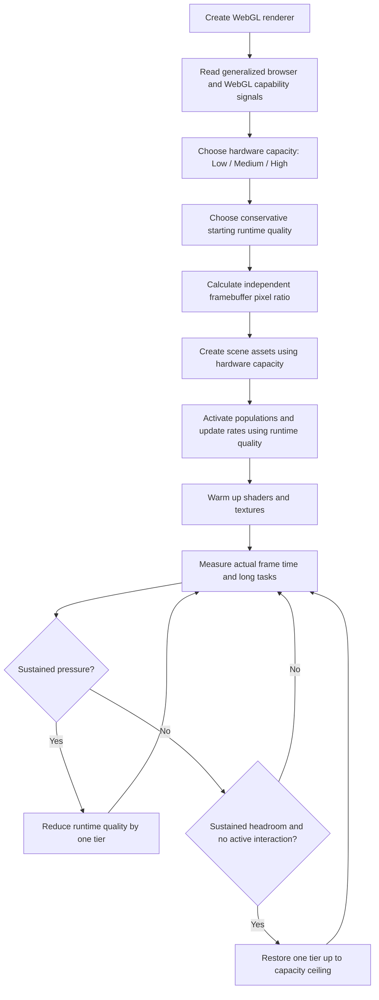

# Beyond Earth — Adaptive Performance Manager

> Detailed technical guide for the generalized performance system used by the **Beyond Earth** Three.js/WebGL experience.

The Performance Manager keeps the project visually consistent across a wide range of devices by separating **asset capacity**, **runtime quality**, and **rendering resolution**. It does not identify a particular computer model and it does not use one hard-coded “mobile versus desktop” rule. Instead, it combines browser-visible capability signals with real measured frame performance.

---

## Table of contents

1. [Purpose](#1-purpose)
2. [Core design](#2-core-design)
3. [The three independent performance layers](#3-the-three-independent-performance-layers)
4. [What the manager changes](#4-what-the-manager-changes)
5. [What the manager never changes](#5-what-the-manager-never-changes)
6. [Source files and integration](#6-source-files-and-integration)
7. [Startup lifecycle](#7-startup-lifecycle)
8. [Hardware-capacity detection](#8-hardware-capacity-detection)
9. [CPU-core planning table](#9-cpu-core-planning-table)
10. [Other capability signals](#10-other-capability-signals)
11. [Capacity score resolution](#11-capacity-score-resolution)
12. [Initial runtime-quality selection](#12-initial-runtime-quality-selection)
13. [Independent high-DPI and framebuffer control](#13-independent-high-dpi-and-framebuffer-control)
14. [Runtime presets](#14-runtime-presets)
15. [Frame monitoring](#15-frame-monitoring)
16. [Downgrade and recovery logic](#16-downgrade-and-recovery-logic)
17. [Long-task detection](#17-long-task-detection)
18. [Interaction awareness](#18-interaction-awareness)
19. [Task scheduling](#19-task-scheduling)
20. [Frame-rate-independent animation](#20-frame-rate-independent-animation)
21. [Space-environment optimization](#21-space-environment-optimization)
22. [Asteroid-belt optimization](#22-asteroid-belt-optimization)
23. [Sun optimization](#23-sun-optimization)
24. [Planet, Earth, Moon, ring, and satellite optimization](#24-planet-earth-moon-ring-and-satellite-optimization)
25. [Texture anisotropy](#25-texture-anisotropy)
26. [Memory and garbage-collection optimization](#26-memory-and-garbage-collection-optimization)
27. [Visibility and lifecycle pausing](#27-visibility-and-lifecycle-pausing)
28. [InstancedMesh safety notes](#28-instancedmesh-safety-notes)
29. [Privacy-safe browser capability handling](#29-privacy-safe-browser-capability-handling)
30. [Worked device scenarios](#30-worked-device-scenarios)
31. [Complete summary tables](#31-complete-summary-tables)
32. [Testing and diagnostics](#32-testing-and-diagnostics)
33. [Current limitations and future work](#33-current-limitations-and-future-work)
34. [FAQ](#34-faq)

---

## 1. Purpose

Beyond Earth is hosted like a normal website, but its Three.js universe is rendered primarily by the visitor’s device. The hosting platform delivers HTML, CSS, JavaScript, shaders, textures, and other assets; the browser then performs the real-time work.

That work includes:

- WebGL draw calls
- vertex and fragment shader execution
- geometry processing
- transparent atmosphere and glow overdraw
- star, galaxy, dust, and asteroid rendering
- camera movement and focus transitions
- planet and satellite animation
- raycasting and hover calculations
- distance-card and inspection-card updates
- texture sampling and GPU memory usage

Applying one maximum workload to every visitor would produce poor results on weaker devices and unnecessarily high power usage on high-DPI screens.

The Performance Manager therefore aims to provide:

- the same navigation and interaction model
- the same cinematic composition
- the same celestial data and distance calculations
- the same focused-body experience
- less invisible or unnoticeable rendering work
- stable frame pacing instead of repeated quality fluctuation

The goal is **perceptual consistency**, not the impossible promise that every internal mesh, particle, and pixel will be identical on every device.

---

## 2. Core design

The current system follows this flow:



The most important design rule is:

> **Hardware capacity, runtime quality, and drawing-buffer resolution are separate decisions.**

A powerful device with a large high-DPI viewport may keep High-capacity assets while rendering them at a lower internal pixel ratio. A weaker device may create only Low-capacity assets. A strong touch device may create High-capacity assets but begin at Medium runtime quality until measured performance proves that High is sustainable.

---

## 3. The three independent performance layers

The manager stores three related but independent concepts.

### 3.1 `capacityName` / `hardwareCapacity`

This is the maximum asset and geometry capacity created for the browser session.

It controls creation-time decisions such as:

- planet geometry complexity
- Sun geometry complexity
- maximum Sun particle capacity
- asteroid instance-buffer capacity
- maximum star and galaxy capacity
- Earth shell geometry
- Moon geometry
- major-satellite geometry and texture size
- texture anisotropy ceiling

The capacity is normally fixed after scene creation because replacing large geometry during runtime would introduce stutter and memory churn.

### 3.2 `qualityName` / `runtimeQuality`

This is the quality currently active while the experience is running.

It controls:

- active point and instance counts
- Sun effect visibility and density
- task-update frequencies
- optional dust and zodiacal-light visibility
- hover timing
- framebuffer budget and maximum pixel ratio

Runtime quality may decrease when sustained pressure is detected and recover only up to the hardware-capacity ceiling.

### 3.3 `pixelRatio` / `renderScale`

This controls the size of the WebGL drawing buffer independently of asset detail.

```js
renderScale = effectivePixelRatio / requestedDevicePixelRatio;
```

A value below `1` means the canvas still occupies the same CSS size, but Three.js renders fewer internal pixels and the browser scales the result to the display.

### Example tier relationships

```text
High capacity
├── Runtime High
├── Runtime Medium
└── Runtime Low

Medium capacity
├── Runtime Medium
└── Runtime Low

Low capacity
└── Runtime Low
```

A High-capacity scene can temporarily use Medium or Low active populations without rebuilding its buffers. A Low-capacity scene cannot upgrade beyond Low because the expensive High resources were intentionally never created.

---

## 4. What the manager changes

The manager may change or influence:

- renderer pixel ratio
- internal framebuffer pixel count
- active background-star count
- active Milky Way star count
- active parallax-star count
- active hero-star count
- active galaxy count
- active cosmic-dust count
- zodiacal-light visibility
- asteroid instance count
- unresolved asteroid-debris count
- Sun spicule count
- Sun jet, loop, and flare visibility
- Sun particle count
- update frequency of expensive visual systems
- hover-processing delay
- creation-time geometry detail
- creation-time anisotropy
- work performed while the document is hidden

The preferred reduction order is:

```text
1. Details too small to see
2. Distant transparent effects
3. Excess background population density
4. Unnecessarily frequent calculations
5. Excess internal rendering resolution
6. Preserve focused objects and core interaction for as long as possible
```

---

## 5. What the manager never changes

The manager does not alter:

- celestial positions
- orbital mathematics
- camera-navigation rules
- focused-body camera framing
- Travel Back to Earth behavior
- empty-space regional travel
- distance-from-Earth calculations
- kilometer, AU, or light-year conversion
- UI text and scientific metadata
- clickability of major celestial bodies
- scene chronology and journey progression
- the visual identity of the project

This separation is intentional. Performance decisions should not change the meaning or behavior of the experience.

---

## 6. Source files and integration

The main controller is:

```text
src/js/performance/performanceManager.js
```

It is integrated from:

```text
src/js/main.js
```

Related systems include:

```text
src/js/scene/space/spaceEnvironment.js
src/js/scene/space/spaceEnvironmentConfig.js
src/js/scene/asteroidBelt.js
src/js/stars/sun/sun.js
src/js/scene/planetFactory.js
src/js/planets/earth/satellites/moon.js
src/js/planets/satellites/satelliteSystem.js
src/js/graphics/loadTextures.js
```

### Main construction flow

```js
const renderer = new THREE.WebGLRenderer({
  canvas,
  antialias: true,
  alpha: false,
  powerPreference: "high-performance",
});

const performanceManager = new PerformanceManager({
  renderer,
  reducedMotion: window
    .matchMedia("(prefers-reduced-motion: reduce)")
    .matches,
});

const creationQuality = performanceManager.capacityName;
```

Every creation-time system receives `creationQuality`, while dynamic systems subscribe to runtime-quality snapshots.

```js
performanceManager.subscribe(({ qualityName, preset, pixelRatio }) => {
  spaceEnvironment.setQuality(preset.environmentQuality);
  spaceEnvironment.resize(innerWidth, innerHeight, pixelRatio);
  setAsteroidBeltQuality(asteroidBelt, qualityName, pixelRatio);
  setSunPerformanceProfile(sun, qualityName, {
    projectedRadiusPixels: currentSunProjectedRadiusPixels,
    focused: isSunFocused,
  });
});
```

---

## 7. Startup lifecycle

1. Create the renderer and WebGL context.
2. Read CPU, optional memory, WebGL, and optional GPU-renderer signals.
3. Calculate `capacityName`.
4. Calculate conservative `qualityName` without lowering asset capacity because of viewport size or DPI.
5. Calculate an independent effective pixel ratio.
6. Apply `renderer.setPixelRatio()` and `renderer.setSize()`.
7. Load textures with capacity-appropriate anisotropy.
8. Create Sun, planets, Earth layers, Moon, satellites, asteroids, and space environment using `capacityName`.
9. Subscribe runtime systems to quality changes.
10. Start the render loop.
11. Exclude the first 4.5 seconds from adaptive decisions.
12. Evaluate measured frame performance every 2.4 seconds.
13. Downgrade or recover only after sustained evidence.

---

## 8. Hardware-capacity detection

The function is:

```js
detectHardwareCapacity({ renderer, navigatorObject })
```

It calculates a score from generalized signals. It does not use viewport width, viewport height, device pixel ratio, or reduced-motion preference as evidence of weak hardware.

### Capacity rules

```js
if (forceLow) return "low";
if (score <= -1.5) return "low";
if (score >= 3.5) return "high";
return "medium";
```

Some extremely weak signals can set `forceLow`, while uncertain or unavailable signals remain neutral.

---

## 9. CPU-core planning table

`navigator.hardwareConcurrency` reports logical processor threads visible to the browser. It is useful but not a perfect GPU-performance measurement, so it contributes to a score rather than deciding the entire tier alone.

| Browser-reported logical cores | Score adjustment | General interpretation | Likely creation direction |
|---:|---:|---|---|
| 1–2 | Force Low | Very constrained CPU scheduling | Low capacity |
| 3–4 | −2 | Entry-level or older mobile/laptop class | Low or Medium depending on other signals |
| 5–6 | −1 | Moderate CPU capacity | Usually Medium unless WebGL/GPU signals are strong |
| 7 | 0 | Neutral/uncertain band | Determined by other signals |
| 8–11 | +2 | Strong general-purpose processing | Medium or High |
| 12+ | +3 | High CPU concurrency | Strong High candidate |
| Missing/blocked | 0 | Unknown | Neutral; do not penalize |

### Why cores are not enough

A high core count does not guarantee high fragment-shader throughput, and a low-power GPU can still bottleneck a complex transparent scene. Conversely, some efficient integrated GPUs perform much better than their CPU-core count suggests.

Therefore cores are combined with:

- WebGL texture capacity
- renderbuffer capacity
- WebGL 2 availability
- multisampling capability
- optional memory signal
- optional GPU renderer hints
- actual runtime frame time

---

## 10. Other capability signals

### 10.1 Device memory

`navigator.deviceMemory` is approximate, privacy-reduced, capped by some browsers, and unavailable in others.

| Reported value | Score adjustment |
|---:|---:|
| ≤ 2 GB | Force Low |
| > 2 to 3 GB | −2 |
| > 3 to 4 GB | −1 |
| 5–7 GB | 0 |
| ≥ 8 GB | +1 |
| Missing/undefined | 0 |

An unknown value is not converted to 6 GB and does not automatically force Medium.

### 10.2 Maximum texture size

| `MAX_TEXTURE_SIZE` | Effect |
|---:|---:|
| < 4096 | Force Low |
| 4096–8191 | −2 |
| 8192–16383 | 0 |
| ≥ 16384 | +1 |

This measures an important WebGL capability, but it is not a direct benchmark of shader speed.

### 10.3 Maximum renderbuffer size

| `MAX_RENDERBUFFER_SIZE` | Effect |
|---:|---:|
| < 4096 | Force Low |
| 4096–8191 | −1 |
| 8192–16383 | 0 |
| ≥ 16384 | +1 |

This also protects drawing-buffer sizing from exceeding GPU limits.

### 10.4 WebGL version

| Capability | Effect |
|---|---:|
| WebGL 2 available | +0.5 |
| WebGL 2 unavailable | −0.5 |

### 10.5 Multisampling

| Capability | Effect |
|---|---:|
| `MAX_SAMPLES >= 4` | +0.25 |
| Otherwise/unknown | 0 |

### 10.6 Optional GPU renderer string

The `WEBGL_debug_renderer_info` extension may be unavailable because of privacy settings. Missing data is neutral.

The current generalized behavior is:

- known software renderers such as SwiftShader or LLVMpipe force Low
- broad modern GPU hints provide only `+1`
- the renderer string never becomes the sole reason for High capacity

```text
Software renderer detected → Force Low
Recognized modern GPU family → Small positive hint
Renderer string unavailable → Neutral
```

---

## 11. Capacity score resolution

A few examples illustrate how the score works.

### Example A — weak device

```text
4 cores                    -2
3 GB reported memory       -2
8192 texture size           0
8192 renderbuffer size      0
WebGL 2                    +0.5
Total                      -3.5
Result                     Low
```

### Example B — ordinary mid-range device with hidden memory API

```text
6 cores                    -1
Memory unavailable          0
8192 texture size           0
8192 renderbuffer size      0
WebGL 2                    +0.5
Total                      -0.5
Result                     Medium
```

### Example C — strong generalized hardware

```text
8 cores                    +2
8 GB reported memory       +1
16384 texture size         +1
16384 renderbuffer size    +1
WebGL 2                    +0.5
4x multisampling          +0.25
Total                     +5.75
Result                     High
```

The real runtime monitor remains the final authority. A device classified High may still move to Medium when a demanding viewport, browser state, thermal condition, or background workload creates sustained pressure.

---

## 12. Initial runtime-quality selection

Hardware capacity defines the ceiling, but the initial runtime tier may be more conservative.

```js
detectInitialRuntimeQuality({
  capacityName,
  navigatorObject,
  windowObject,
});
```

Current rules:

| Capacity | Form factor | Starting runtime quality | Upgrade ceiling |
|---|---|---|---|
| Low | Any | Low | Low |
| Medium | Any | Medium | Medium |
| High | Fine-pointer/non-mobile | High | High |
| High | Coarse-only pointer or mobile form factor | Medium | High |

A high-capacity touch device can therefore start at Medium to avoid an aggressive initial load, then recover to High after sustained measured headroom.

A touchscreen laptop with an available fine pointer is not automatically treated as coarse-only.

---

## 13. Independent high-DPI and framebuffer control

High-DPI rendering is a fill-rate problem, not proof that asset geometry should be lower.

The function is:

```js
calculatePixelRatioLimit({
  qualityName,
  width,
  height,
  requestedPixelRatio,
  renderer,
});
```

### Runtime framebuffer presets

| Runtime quality | Maximum DPR | Framebuffer pixel budget | Preferred minimum DPR |
|---|---:|---:|---:|
| High | 2.00 | 5,800,000 | 1.00 |
| Medium | 1.45 | 3,800,000 | 0.90 |
| Low | 1.05 | 2,200,000 | 0.75 |

The manager calculates:

```text
CSS pixels = viewport width × viewport height
Budget DPR = square root(framebuffer pixel budget ÷ CSS pixels)
Dimension limit = max renderbuffer dimension ÷ viewport dimension
```

The final effective DPR is constrained by:

- the browser-requested DPR
- the runtime tier’s maximum DPR
- the framebuffer pixel budget
- the GPU renderbuffer dimension limit
- a safe lower bound of 0.5

### Example

For a `1920 × 1080` CSS viewport at requested DPR `2`:

```text
Requested framebuffer = 1920 × 1080 × 2²
                      = 8,294,400 pixels
```

High quality has a 5.8 million pixel budget, so the calculated budget DPR is approximately:

```text
sqrt(5,800,000 ÷ 2,073,600) ≈ 1.67
```

The device can retain High-capacity geometry while rendering at roughly DPR 1.67 instead of DPR 2.

### Why this matters

Lowering the drawing-buffer density reduces:

- fullscreen fragment-shader work
- transparent atmosphere overdraw
- Sun corona and glow processing
- star and dust pixel processing
- GPU bandwidth
- battery and thermal pressure

It does not change the CSS layout or camera mathematics.

---

## 14. Runtime presets

The runtime presets are defined in `PERFORMANCE_PRESETS`.

### High

```text
Max DPR: 2.0
Pixel budget: 5.8 million
Minimum preferred DPR: 1.0
Environment quality: High
Hover delay: 18 ms
Most scene systems update every frame
```

### Medium

```text
Max DPR: 1.45
Pixel budget: 3.8 million
Minimum preferred DPR: 0.9
Environment quality: Medium
Hover delay: 32 ms
Expensive visual systems use reduced update frequencies
```

### Low

```text
Max DPR: 1.05
Pixel budget: 2.2 million
Minimum preferred DPR: 0.75
Environment quality: Low
Hover delay: 52 ms
Distant and transparent systems receive the largest reductions
```

---

## 15. Frame monitoring

After setup, the project calls:

```js
performanceManager.startMonitoring();
```

Each valid frame reports its elapsed time:

```js
performanceManager.recordFrame(deltaTime);
```

### Warm-up

The first `4.5` seconds are excluded from adaptive decisions. This gives the browser time to perform first-use work such as:

- shader compilation
- texture upload
- geometry-buffer initialization
- first material/program creation
- browser cache population

### Exponential moving average

The manager stores a smoothed frame duration.

```js
const alpha = frameMs > frameTimeEma ? 0.10 : 0.035;
```

Slow frames affect the average more quickly than fast frames. This makes the manager respond to pressure promptly but recover cautiously.

### Valid-frame filtering

Invalid, zero, negative, or very large frame deltas above `0.25` seconds are ignored by the monitor. The main loop itself clamps the simulation delta to `0.05` seconds to prevent large jumps after interruptions.

### Evaluation window

Quality is evaluated every `2.4` seconds after the warm-up period.

---

## 16. Downgrade and recovery logic

### Downgrade thresholds

| Current runtime tier | Slow threshold |
|---|---:|
| High | Below 47 FPS |
| Medium | Below 38 FPS |
| Low | Below 38 FPS, but no lower tier exists |

A downgrade requires two consecutive slow evaluation windows.

```text
2.4 seconds × 2 ≈ 4.8 seconds of sustained pressure
```

### Upgrade thresholds

| Current runtime tier | Headroom threshold |
|---|---:|
| Low | Above 53 FPS |
| Medium | Above 57 FPS |
| High | Already at maximum runtime tier |

An upgrade requires four fast windows:

```text
2.4 seconds × 4 ≈ 9.6 seconds of sustained headroom
```

### Cooldown

After every tier change, an `8` second cooldown prevents immediate reversal.

### Hysteresis result

```text
Pressure response: relatively quick
Recovery: deliberately slower
Tier oscillation: strongly reduced
```

The manager changes only one tier at a time:

```text
High → Medium → Low
Low → Medium → High, never above capacity
```

---

## 17. Long-task detection

FPS alone may not reveal all main-thread pressure. The manager optionally creates a `PerformanceObserver` for browser `longtask` entries.

Each reported group increases `longTaskPressure`, capped at `6`.

```js
longTaskPressure += entryCount;
```

The pressure decays over time at approximately:

```text
0.45 pressure units per second
```

A value of `2` or greater is treated as active load during quality evaluation.

This can detect pressure from:

- expensive JavaScript loops
- garbage-collection pauses
- heavy DOM work
- blocking third-party scripts
- other main-thread tasks

The API is optional. If unsupported or blocked, the manager continues using frame time alone.

---

## 18. Interaction awareness

Input handlers call:

```js
performanceManager.markInteraction(durationMs);
```

The project marks interaction during operations such as:

- wheel and scroll movement
- pointer movement
- pointer down/up
- drag gestures
- touch gestures
- keyboard navigation

Typical durations in the current integration range from approximately `850 ms` to `1400 ms`.

### Why interaction matters

An idle scene may produce higher FPS than an actively moving camera. Without interaction awareness, the manager could upgrade while idle and immediately struggle once travel resumes.

The current rule is:

- downgrade is still allowed during interaction when pressure is sustained
- upgrade is blocked while interaction is active

---

## 19. Task scheduling

The render loop still uses `requestAnimationFrame`, but not every subsystem must run at the display refresh rate.

The manager exposes:

```js
consumeTaskDelta(taskName, deltaSeconds)
```

It returns:

- `0` when the task should wait
- the accumulated elapsed time when the task should run

### Current update frequencies

| Task | High | Medium | Low |
|---|---:|---:|---:|
| Distance readout | 30 Hz | 24 Hz | 18 Hz |
| Inspection UI | 45 Hz | 30 Hz | 24 Hz |
| Hover visuals | 60 Hz | 40 Hz | 30 Hz |
| Planet visual layers | Every frame | 40 Hz | 30 Hz |
| Major satellites | Every frame | Every frame | Every frame |
| Sun effects | Every frame | 36 Hz | 24 Hz |
| Asteroid system | Every frame | 30 Hz | 20 Hz |
| Space environment | Every frame | 40 Hz | 28 Hz |

### Why accumulated delta is necessary

Suppose a 30 Hz task is running inside a 60 Hz render loop:

```text
Frame 1: accumulate 16.7 ms, do not update
Frame 2: accumulate 33.4 ms, update using the full 33.4 ms
```

The animation remains time-correct instead of moving at half speed.

---

## 20. Frame-rate-independent animation

Older frame-dependent code often looks like:

```js
planet.rotation.y += spinSpeed;
```

That moves at different real-world speeds on 30 FPS and 60 FPS devices.

The updated system uses elapsed time:

```js
const frameScale = deltaTime * 60;
planet.rotation.y += spinSpeed * frameScale;
```

Camera easing uses:

```js
function frameAdjustedEase(baseFactor, deltaSeconds) {
  return 1 - Math.pow(
    1 - THREE.MathUtils.clamp(baseFactor, 0, 1),
    Math.max(0, deltaSeconds) * 60,
  );
}
```

This keeps camera travel, focus, zoom, and rotation behavior consistent across different frame rates and reduced subsystem update frequencies.

---

## 21. Space-environment optimization

The space environment creates its maximum population using `capacityName`, then adjusts active counts using runtime quality.

### Runtime population targets

| Layer | High | Medium | Low |
|---|---:|---:|---:|
| Background stars | 30,000 | 21,000 | 12,000 |
| Milky Way stars | 26,000 | 18,500 | 10,000 |
| Parallax stars | 1,300 | 900 | 480 |
| Hero stars | 72 | 52 | 28 |
| Galaxies | 96 | 72 | 40 |
| Dust particles | 1,180 | 760 | 280 |
| Hero stars enabled | Yes | Yes | Yes |
| Galaxies enabled | Yes | Yes | Yes |
| Zodiacal light enabled | Yes | Yes | No |
| Dust layer enabled | Yes | Yes | No |

### Runtime count adjustment

Point-based layers use draw ranges, and instanced layers use active counts. Buffers are not rebuilt during quality changes.

```js
geometry.setDrawRange(0, activeCount);
```

or:

```js
instancedMesh.count = activeCount;
```

The environment is also the only consumer of the manager’s effective pixel ratio for point-size uniforms. It no longer owns renderer sizing, avoiding conflicting DPR logic.

---

## 22. Asteroid-belt optimization

The asteroid belt combines:

- individually modeled resolved bodies
- instanced 3D boulders
- unresolved point-sized debris

Base High targets are:

```text
Instanced boulders: 14,500
Unresolved debris: 120,000
```

### Density presets

| Quality | Instanced density | Debris density | Approx. instanced capacity | Approx. debris capacity |
|---|---:|---:|---:|---:|
| High | 100% | 100% | 14,500 | 120,000 |
| Medium | 72% | 65% | 10,440 | 78,000 |
| Low | 44% | 34% | 6,380 | 40,800 |

Important resolved bodies remain present and inspectable. The manager primarily reduces the enormous background population.

### Runtime behavior

```js
mesh.count = activeCount;
mesh.userData.activeInstanceCount = activeCount;
```

Point debris uses:

```js
debris.geometry.setDrawRange(0, activeCount);
```

The custom asteroid selection helper limits its checks to the active instance count, preventing hidden instances from remaining selectable.

---

## 23. Sun optimization

The Sun is one of the most expensive objects because it combines several transparent and animated layers.

### Creation profiles

| Property | High | Medium | Low |
|---|---:|---:|---:|
| Photosphere segments | 192 × 128 | 144 × 96 | 112 × 72 |
| Chromosphere segments | 144 × 96 | 112 × 72 | 80 × 56 |
| Inner-corona segments | 128 × 88 | 96 × 64 | 72 × 48 |
| Outer-corona segments | 112 × 80 | 80 × 56 | 64 × 40 |
| Spicules | 560 | 420 | 280 |
| Particles per jet | 42 | 32 | 24 |
| Particles per loop | 34 | 26 | 20 |
| Flare arc particles | 92 | 68 | 48 |
| Flare ejecta particles | 34 | 26 | 18 |
| Flare ring segments | 96 | 72 | 48 |

### Runtime profiles

| Runtime quality | Detail ratio | Minimum projected radius for detailed effects |
|---|---:|---:|
| High | 1.00 | 7 px |
| Medium | 0.76 | 12 px |
| Low | 0.50 | 18 px |

The Sun is considered:

- **resolved** when focused or above the tier’s projected-radius threshold
- **close** when focused or at least 72 projected pixels in radius

When unresolved:

- spicules are hidden
- jets are hidden
- loops are hidden
- flares are hidden
- the distant star/glow representation remains

When resolved but not close, the manager uses smaller subsets of jets, loops, flares, and particles. When close or focused, it uses the richest detail allowed by the creation capacity and runtime tier.

The code stores a compact performance signature such as:

```text
medium|1|0
```

If the runtime tier and visibility state have not changed, the profile function exits early instead of repeatedly updating every particle’s visibility.

---

## 24. Planet, Earth, Moon, ring, and satellite optimization

### Planet geometry scale

| Capacity | Segment multiplier |
|---|---:|
| High | 1.00 |
| Medium | 0.78 |
| Low | 0.58 |

Safety minimums prevent spheres and rings from becoming visibly polygonal.

This scaling applies to:

- planet spheres
- atmosphere shells
- Venus cloud layers
- giant-planet ring bands
- torus-based ring details

### Earth layers

| Capacity | Cloud/atmosphere/light sphere segments |
|---|---:|
| High | 96 × 96 |
| Medium | 80 × 80 |
| Low | 64 × 64 |

### Moon

| Capacity | Moon sphere segments | Crater circle segments | Crater torus segments |
|---|---:|---:|---:|
| High | 160 × 160 | 28 | 32 |
| Medium | 128 × 128 | 22 | 26 |
| Low | 96 × 96 | 16 | 20 |

### Major planetary satellites

| Capacity | Shared procedural texture | Shared sphere geometry | Orbit-line segments |
|---|---:|---:|---:|
| High | 768 px | 56 × 40 | 128 |
| Medium | 512 px | 44 × 32 | 96 |
| Low | 384 px | 32 × 24 | 64 |

The satellite system shares geometry and one generated texture rather than creating redundant geometry and texture data for each moon.

---

## 25. Texture anisotropy

Texture anisotropy improves sharpness at steep viewing angles but increases sampling work.

| Capacity | Preferred anisotropy |
|---|---:|
| High | 8 |
| Medium | 4 |
| Low | 2 |

The requested value is capped by the GPU:

```js
Math.min(
  renderer.capabilities.getMaxAnisotropy(),
  preferredAnisotropy,
);
```

This is selected at load time rather than changed repeatedly at runtime.

---

## 26. Memory and garbage-collection optimization

Frequently executed code previously risked creating temporary objects on every frame or pointer update.

The updated code reuses vectors such as:

```js
const hoverWorldPosition = new THREE.Vector3();
const hoverProjectedPosition = new THREE.Vector3();
const connectorProjectedPosition = new THREE.Vector3();
```

instead of repeatedly executing:

```js
const position = new THREE.Vector3();
```

inside hot paths.

This reduces:

- short-lived allocations
- garbage-collection frequency
- unpredictable frame pauses
- memory pressure on low-end browsers

Runtime population changes also reuse existing buffers through draw ranges and instance counts instead of recreating arrays, geometries, shaders, or materials.

---

## 27. Visibility and lifecycle pausing

When the browser tab becomes hidden, the render loop continues to schedule itself but exits before simulation and rendering work.

```js
if (!isPageVisible || isAboutExperienceOpen) {
  requestAnimationFrame(animate);
  return;
}
```

This skips:

- planet updates
- Sun updates
- asteroid updates
- environment updates
- hover/interface projection
- distance-card work
- WebGL rendering

The same pause is used while the Beyond Earth information experience covers the scene.

On a true page discard, cleanup performs:

```js
unsubscribePerformanceManager();
performanceManager.dispose();
spaceEnvironment.dispose();
```

A page stored in the browser back-forward cache is not unnecessarily destroyed.

---

## 28. InstancedMesh safety notes

Changing only:

```js
mesh.count = activeCount;
```

immediately changes how many existing instances are drawn. It does **not** require:

```js
mesh.instanceMatrix.needsUpdate = true;
```

unless one or more individual instance matrices have actually been rewritten with operations such as `setMatrixAt()`.

### Current asteroid behavior

The individual instance matrices are created once. Animation rotates the parent `InstancedMesh` object, so no per-instance matrix buffer upload is required every frame.

### Required future precaution

If future code changes individual instance transforms:

```js
mesh.setMatrixAt(index, matrix);
mesh.instanceMatrix.needsUpdate = true;
```

If those changes affect bounds, recompute the relevant bounding volume for correct culling or raycasting.

The active raycast/search count must continue to use:

```js
mesh.userData.activeInstanceCount
```

or `mesh.count`, so hidden instances cannot be selected.

---

## 29. Privacy-safe browser capability handling

Browser capability APIs are not guaranteed to expose exact hardware details.

The implementation follows these rules:

- missing `deviceMemory` is neutral
- privacy-capped memory is treated as a weak hint
- missing GPU renderer string is neutral
- GPU renderer string is only a soft positive hint
- explicit software renderer detection may force Low
- viewport size and DPR do not lower hardware capacity
- reduced-motion preference is not treated as weak hardware
- real measured frame time remains the final authority

This avoids false downgrades on browsers that intentionally hide hardware information.

---

## 30. Worked device scenarios

These are generalized examples, not device-specific guarantees.

### Scenario A — entry-level phone

```text
4 cores
3 GB reported memory
WebGL 2 available
8192 texture/renderbuffer limits
Coarse-only pointer
```

Likely result:

```text
Capacity: Low
Runtime: Low
DPR: approximately 0.75–1.05 depending on viewport
Assets: Low creation profiles
```

### Scenario B — ordinary office laptop

```text
6 cores
Memory API unavailable
WebGL 2 available
8192 limits
Fine pointer
```

Likely result:

```text
Capacity: Medium
Runtime: Medium
DPR: independently calculated, maximum 1.45
Assets: Medium creation profiles
```

### Scenario C — strong high-DPI laptop

```text
8+ cores
Strong WebGL limits
High requested DPR
Large fullscreen viewport
Fine pointer
```

Likely result:

```text
Capacity: High
Runtime: High initially
Assets: High creation profiles
DPR: capped by the 5.8 million pixel budget
```

The device keeps premium assets without being forced to render every scene layer at the native high-DPI framebuffer size.

### Scenario D — strong tablet or touch-first device

```text
High capacity score
Coarse-only pointer or mobile form factor
```

Likely result:

```text
Capacity: High
Initial runtime: Medium
Upgrade ceiling: High
DPR: Medium budget initially
```

If real performance remains above the recovery threshold for long enough, runtime quality can increase to High without rebuilding the High-capacity assets.

### Scenario E — software renderer

```text
Renderer string contains SwiftShader or LLVMpipe
```

Result:

```text
Capacity: Low
Runtime: Low
```

Software rasterization is explicitly treated as a constrained fallback.

---

## 31. Complete summary tables

### 31.1 Responsibility summary

| Concern | Fixed or dynamic? | Main authority | What it controls |
|---|---|---|---|
| Hardware capacity | Fixed for session | Capability scoring | Maximum geometry and buffer capacity |
| Runtime quality | Dynamic | Measured frame performance | Active populations, update rates, optional effects |
| Pixel ratio | Dynamic on resize/tier change | Pixel budget and GPU limit | Internal framebuffer resolution |
| Reduced motion | Preference-driven | Browser media query | Motion policy in environment, not hardware capacity |
| Interaction state | Temporary | Input handlers | Blocks premature quality upgrades |
| Long-task pressure | Dynamic | PerformanceObserver | Supporting downgrade signal |

### 31.2 High/Medium/Low overview

| Area | High | Medium | Low |
|---|---|---|---|
| Max DPR | 2.0 | 1.45 | 1.05 |
| Framebuffer budget | 5.8M | 3.8M | 2.2M |
| Background stars | 30,000 | 21,000 | 12,000 |
| Milky Way stars | 26,000 | 18,500 | 10,000 |
| Galaxies | 96 | 72 | 40 |
| Dust enabled | Yes | Yes | No |
| Zodiacal light | Yes | Yes | No |
| Asteroid instance density | 100% | 72% | 44% |
| Asteroid debris density | 100% | 65% | 34% |
| Sun detail ratio | 100% | 76% | 50% |
| Planet segment scale | 100% | 78% | 58% |
| Anisotropy preference | 8 | 4 | 2 |
| Hover delay | 18 ms | 32 ms | 52 ms |

### 31.3 Adaptation timing summary

| Setting | Value |
|---|---:|
| Warm-up period | 4.5 seconds |
| Evaluation interval | 2.4 seconds |
| Slow windows required | 2 |
| Fast windows required | 4 |
| Tier-change cooldown | 8 seconds |
| High downgrade threshold | 47 FPS |
| Medium downgrade threshold | 38 FPS |
| Low-to-Medium upgrade threshold | 53 FPS |
| Medium-to-High upgrade threshold | 57 FPS |
| Long-task pressure threshold | 2 |

### 31.4 What remains visually protected

| Feature | Protection strategy |
|---|---|
| Focused celestial body | Richest detail permitted by capacity and runtime tier |
| Camera travel | Time-based and unchanged by quality tier |
| Distances and units | Completely independent from performance manager |
| Major planets and moons | Remain present and clickable |
| Resolved asteroids | Remain modeled and inspectable |
| Background composition | Density reduces before core layers disappear |
| UI design | Same layout and content |

---

## 32. Testing and diagnostics

### 32.1 Snapshot inspection

The manager exposes a snapshot containing:

```js
{
  capacityName,
  hardwareCapacity,
  qualityName,
  runtimeQuality,
  requestedPixelRatio,
  pixelRatio,
  renderScale,
  framebufferPixels,
  reason,
}
```

A temporary development subscriber can log changes:

```js
const unsubscribe = performanceManager.subscribe((snapshot) => {
  console.table(snapshot);
});
```

Remove development logging from production when it is no longer required.

### 32.2 Manual tier testing

During development:

```js
performanceManager.setQuality("low", "developer-test");
performanceManager.setQuality("medium", "developer-test");
performanceManager.setQuality("high", "developer-test");
```

The requested tier is still capped by `capacityName`.

### 32.3 Resize testing

Test:

- small browser window
- fullscreen window
- device emulation at DPR 1, 2, and 3
- landscape and portrait viewports
- very large CSS viewport

Verify that capacity does not change merely because of viewport size, while effective DPR does.

### 32.4 Performance conditions

Test under:

- CPU throttling
- background tabs
- battery-saving modes
- browser DevTools open and closed
- touch emulation
- reduced-motion preference
- software-rendered or virtualized environments when available

### 32.5 Three.js diagnostics

Development builds may inspect:

```js
renderer.info.render.calls;
renderer.info.render.triangles;
renderer.info.memory.geometries;
renderer.info.memory.textures;
renderer.info.programs;
```

These values help separate:

- draw-call pressure
- triangle pressure
- texture-memory pressure
- shader/material proliferation
- excessive GPU resource retention

---

## 33. Current limitations and future work

The current manager is a substantial adaptive layer, but it does not yet implement every possible optimization.

### Not currently implemented

- KTX2/Basis compressed textures
- multiple texture resolutions loaded on demand
- true mesh-swapping `THREE.LOD` planets
- region-based asset streaming and unloading
- GPU timer-query profiling
- separate half-resolution bloom pipeline
- user-facing quality selector
- persistent user quality preference
- detailed developer HUD
- true idle-frame limiter
- WebGL context-loss recovery workflow
- per-material shader-complexity variants for every body

### Recommended future order

1. Add a small optional developer diagnostics overlay.
2. Add KTX2 texture compression.
3. Introduce focused-body high-resolution texture loading.
4. Add true LOD meshes for the most expensive planets.
5. Add region-based activation for deep-space content.
6. Add idle rendering reduction.
7. Add a user override: Auto, High, Medium, Low.
8. Add WebGL context-loss recovery.

The automatic mode should remain the default, with manual selection treated as an override rather than replacing runtime safety completely.

---

## 34. FAQ

### Does hosting on a stronger server reduce the user’s GPU load?

No. Hosting improves delivery, caching, and asset-download speed. WebGL rendering still occurs on the visitor’s device.

### Does a high-DPI screen automatically mean Medium capacity?

No. DPI affects framebuffer cost, not hardware asset capacity. The current design caps effective DPR independently.

### Does missing `navigator.deviceMemory` mean the device has low memory?

No. Missing memory data is neutral.

### Can runtime quality upgrade above the original capacity?

No. Runtime quality is capped by `capacityName` because higher-capacity geometry and buffers may not exist.

### Does changing `InstancedMesh.count` require `instanceMatrix.needsUpdate`?

Not when only the active count changes. The flag is required when individual instance matrices are rewritten.

### Are hidden asteroid instances still clickable?

The current custom selection path limits checks to the active instance count, so inactive instances are ignored.

### Is the render loop limited to 30 FPS in Low mode?

No. Rendering still uses `requestAnimationFrame`. Expensive subsystems update less frequently while the main camera and renderer can continue at the browser’s available refresh rate.

### Will animations become slower when updates are skipped?

No. `consumeTaskDelta()` returns accumulated elapsed time so motion remains time-correct.

### Why does recovery take longer than downgrade?

Fast recovery would cause quality oscillation. The manager reacts to sustained pressure sooner and requires longer evidence before restoring detail.

### Does reduced motion mean weak hardware?

No. It is an accessibility preference and is kept separate from hardware-capacity scoring.

### What is the final authority: the detector or real FPS?

The detector chooses a safe starting capacity. Real measured performance controls the active runtime tier.

---

## Final design principle

The Beyond Earth performance system follows one central rule:

> **Create only the maximum assets the browser appears capable of supporting, render only the detail currently visible and sustainable, and never trade away the project’s navigation, meaning, or focused experience before reducing invisible work.**
